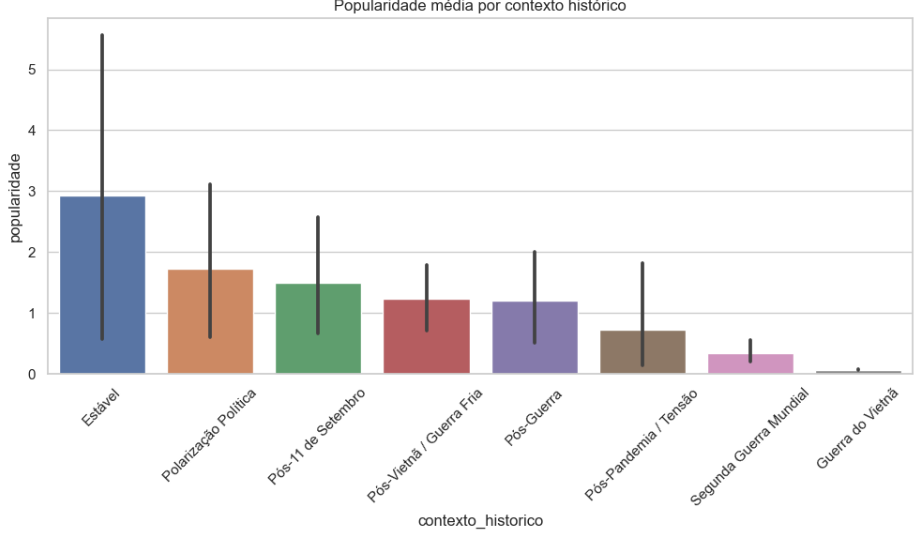

# 🇺🇸 Estrelas da Pátria: A Popularidade dos Filmes Patrióticos ao Longo da História

Este projeto analisa 100 filmes com temática patriótica usando dados reais da TMDb API, com foco em compreender como **momentos históricos** (como guerras, crises ou estabilidade política) influenciam a **popularidade e avaliação pública** dessas produções.

---

## 🖼️ Visualização principal

---

## 📌 Objetivo

Investigar se há relação entre o **momento histórico de lançamento** e a **popularidade ou nota média** dos filmes patrióticos.

---

## 🔍 Perguntas orientadoras

- Filmes patrióticos são mais populares durante guerras ou períodos de estabilidade?
- A polarização política interna influencia o engajamento com filmes patrióticos?
- O contexto histórico afeta a avaliação crítica (nota média) desses filmes?

---

## 🛠️ Tecnologias utilizadas

- Python (Pandas, Seaborn, Matplotlib)
- Jupyter Notebooks
- API da The Movie Database (TMDb)

---

## 📊 Principais descobertas

- 🎯 **Filmes lançados em períodos estáveis ou de polarização política interna** apresentaram **as maiores médias de popularidade.**
- ⚔️ **Filmes lançados durante guerras reais (como Vietnã ou Segunda Guerra Mundial)** tiveram **popularidade média significativamente menor.**
- ⭐️ **As notas médias dos filmes permaneceram estáveis** entre os diferentes contextos históricos, sugerindo que **popularidade e avaliação crítica são fenômenos distintos.**
- ❗️ O filme *Oppenheimer* foi tratado como **outlier**, devido à sua popularidade atípica.
- 🧠 **Filmes patrióticos parecem ganhar mais força em momentos de busca por identidade nacional** — seja em tempos de estabilidade, polarização interna ou incerteza política — do que em guerras propriamente ditas.

---

## 📂 Estrutura do projeto

